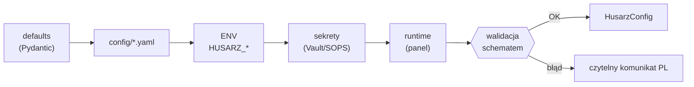

# Architektura Husarza

Dokument opisuje architekturę platformy. Aktualizowany na bieżąco wraz z kodem
(patrz zasady w [CLAUDE.md](https://github.com/Gh0s777tt/Husarz/blob/main/CLAUDE.md)). Stan: **Etap 0**.

## Widok komponentów (docelowy)

```
                        ┌─────────────────────────────┐
                        │            Web UI            │  (Etap 5)
                        │  czat + panel + audyt + koszt│
                        └──────────────┬──────────────┘
                                       │ REST/WS
                        ┌──────────────▼──────────────┐
                        │         API (FastAPI)        │  (Etap 5)
                        └──────────────┬──────────────┘
                                       │
        ┌──────────────────────────────────────────────────────────┐
        │                     RDZEŃ (core)                           │
        │  ┌────────────┐  ┌──────────────┐  ┌───────────────────┐  │
        │  │ Orchestrator│  │  Router modeli│  │  Security/ROE-gate│  │
        │  │  „Husarz"   │  │ (OpenAI-compat│  │  audit, egress,   │  │
        │  │ plan→deleguj│  │  vLLM/Ollama) │  │  mTLS, RBAC       │  │
        │  └─────┬──────┘  └──────┬───────┘  └─────────┬─────────┘  │
        │        │                │                    │             │
        │  ┌─────▼──────┐  ┌───────▼──────┐   ┌─────────▼─────────┐  │
        │  │   Agenci   │  │   Narzędzia  │   │      Pamięć       │  │
        │  │ (Chorągiew)│  │  w sandboxie │   │  pgvector + Redis │  │
        │  └────────────┘  └──────────────┘   └───────────────────┘  │
        └──────────────────────────┬───────────────────────────────┘
                                   │  wszystko sterowane przez:
                        ┌──────────▼───────────┐
                        │     KONFIGURACJA     │  ← jedyne źródło prawdy
                        │  config/*.yaml + ENV │     (zero hardcode)
                        └──────────────────────┘
```

## Zaimplementowane

- **Pakiet `husarz.config`** (Etap 0) — schematy, loader, dostawcy sekretów.
- **Launcher CLI** (`husarz.launcher.cli`) — `validate`, `version`.
- **Pakiet `husarz.router`** (Etap 1) — warstwa OpenAI-compat (vLLM/Ollama/SGLang),
  wybór modelu po tagach/agencie, fallbacki, kontrola kosztów, bramka egress.
  Szczegóły: [ROUTER.md](ROUTER.md), [ADR-0003](adr/0003-router-modeli.md).
- **Pakiety `husarz.agents` i `husarz.orchestrator`** (Etap 2) — klasy
  Towarzysz/Pocztowy, ładowarka agentów, hetman „Husarz" (plan → deleguj →
  obserwuj → refleksja → synteza). Szczegóły: [ORKIESTRATOR.md](ORKIESTRATOR.md),
  [ADR-0004](adr/0004-orkiestrator-agenci.md).
- **Pakiet `husarz.tools`** (Etap 3) — narzędzia (`file_edit`, `shell`, `git`,
  `run_tests`, `web`, `rag`) z konfinacją, allowlistami i sandboxem bez sieci;
  executor/fetcher/backend wstrzykiwalne. Szczegóły: [NARZEDZIA.md](NARZEDZIA.md),
  [ADR-0005](adr/0005-narzedzia-sandbox.md).
- **Pakiet `husarz.security`** (Etap 4) — niemodyfikowalny audit log (łańcuch
  skrótów), ROE-gate (twarda bramka Puszkarza, dry-run domyślnie), agent Puszkarz
  (odmowa ofensywy), RBAC oraz dostawcy sekretów File/SOPS/Vault. Szczegóły:
  [BEZPIECZENSTWO.md](BEZPIECZENSTWO.md), [ADR-0006](adr/0006-bezpieczenstwo-roe.md).
- **Pakiet `husarz.api`** (Etap 5) — REST API (FastAPI) + serwowana konsola WWW,
  launcher `husarz up`. Szczegóły: [API.md](API.md), [ADR-0007](adr/0007-api-launcher-web.md).
- **Pakiet `husarz.plugins`** (Etap 12b/13b) — konektor MCP nad wstrzykiwalnym transportem:
  odkrywanie (`tools/list`) i wywołanie (`tools/call`, deny-by-default). Szczegóły:
  [WTYCZKI.md](WTYCZKI.md), [ADR-0015](adr/0015-konektor-mcp.md),
  [ADR-0019](adr/0019-wywolanie-mcp-tools-call.md).
- **Pakiet `husarz.memory`** (Etap 14/14b) — pamięć długoterminowa (RAG): wektorowy backend
  za niezmienionym `RagBackend`, trwały magazyn SQLite i szyfrowanie at-rest.
  Szczegóły: [ADR-0017](adr/0017-pamiec-dlugoterminowa-rag.md),
  [ADR-0018](adr/0018-pamiec-trwala-at-rest.md).
- **Moduł `husarz.ssrf`** (Etap 15/15b/15c) — wspólna warstwa anty-SSRF z **pinowaniem IP** dla
  WSZYSTKICH pięciu ścieżek wychodzących (`web`, wtyczki MCP, integracje Git, embedder pamięci,
  router modeli): nazwa rozwiązywana raz, adres przypinany, `Host`/SNI po nazwie. Ścieżki
  różnią się tylko dwiema flagami polityki (`allow_loopback`, `allow_lan`), a metadane chmury
  są zablokowane niezależnie od nich. Domyka okno TOCTOU DNS-rebindingu. Szczegóły:
  [BEZPIECZENSTWO.md](BEZPIECZENSTWO.md), [ADR-0020](adr/0020-pinowanie-ip-anty-ssrf.md).
- Pakiet `core` to na razie zaślepka; mTLS/OIDC oraz runtime egress/sandbox — Etap 6.

## Hierarchia konfiguracji (zaimplementowana)



Wyższy priorytet nadpisuje niższy. Scalanie jest głębokie dla map; skalary i
listy są nadpisywane w całości. `models.yaml` jest wymagany; pozostałe sekcje
mają wartości domyślne.

### Mapowanie plików na sekcje

| Plik / katalog          | Sekcja      | Klucz kolekcji     |
|-------------------------|-------------|--------------------|
| `config/husarz.yaml`    | `platform`  | —                  |
| `config/models.yaml`    | `models`    | — (wymagany)       |
| `config/routing.yaml`   | `routing`   | —                  |
| `config/security.yaml`  | `security`  | —                  |
| `config/agents/*.yaml`  | `agents`    | pole `name`        |
| `config/tools/*.yaml`   | `tools`     | pole `name`        |
| `config/roe/*.yaml`     | `roe`       | pole `engagement_id`|

## Walidacja krzyżowa

Po złożeniu całości `HusarzConfig` sprawdza spójność:

1. `models.default` istnieje w rejestrze; `fallback` wskazują istniejące modele (bez cykli własnych).
2. `routing.agent_models` wskazuje istniejące modele lub `auto`; `routing.rules[].prefer` musi wskazywać istniejące modele (bez `auto`).
3. `agents[].model` istnieje (lub `auto`); `agents[].tools` istnieją w rejestrze narzędzi (pusty rejestr = każde odwołanie to błąd).
4. Bazowa linia bezpieczeństwa dla profili `prod` i `airgap`: sandbox włączony (`engine != none`), audyt włączony i niemodyfikowalny, szyfrowanie at-rest — nie można ich cicho wyłączyć.
5. Profil `airgap`: egress `deny`, pusta allowlista, brak sieci w sandboxie oraz **lokalne endpointy modeli** (loopback/prywatne/`.local`).
6. Narzędzie z `requires_egress` musi mieć niepustą allowlistę.

Błąd walidacji jest zbierany i prezentowany jako czytelny komunikat po polsku
(`ConfigValidationError`), nie jako surowy stack trace.

## Decyzje architektoniczne

- [ADR-0001](adr/0001-uklad-repo.md) — układ repo (src-layout, pakiet `husarz`).
- [ADR-0002](adr/0002-hierarchia-konfiguracji.md) — hierarchia i walidacja konfiguracji.
