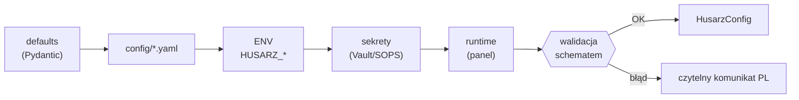

# Architektura Husarza

Dokument opisuje architekturę platformy. Aktualizowany na bieżąco wraz z kodem
(patrz zasady w [CLAUDE.md](../CLAUDE.md)). Stan: **Etap 0**.

## Widok komponentów (docelowy)

```
                        ┌─────────────────────────────┐
                        │            Web UI            │  (Etap 5)
                        │  czat + panel + audyt + koszt│
                        └──────────────┬──────────────┘
                                       │ REST/WS
                        ┌──────────────▼──────────────┐
                        │         API (FastAPI)        │  (Etap 5)
                        └──────────────┬──────────────┘
                                       │
        ┌──────────────────────────────────────────────────────────┐
        │                     RDZEŃ (core)                           │
        │  ┌────────────┐  ┌──────────────┐  ┌───────────────────┐  │
        │  │ Orchestrator│  │  Router modeli│  │  Security/ROE-gate│  │
        │  │  „Husarz"   │  │ (OpenAI-compat│  │  audit, egress,   │  │
        │  │ plan→deleguj│  │  vLLM/Ollama) │  │  mTLS, RBAC       │  │
        │  └─────┬──────┘  └──────┬───────┘  └─────────┬─────────┘  │
        │        │                │                    │             │
        │  ┌─────▼──────┐  ┌───────▼──────┐   ┌─────────▼─────────┐  │
        │  │   Agenci   │  │   Narzędzia  │   │      Pamięć       │  │
        │  │ (Chorągiew)│  │  w sandboxie │   │  pgvector + Redis │  │
        │  └────────────┘  └──────────────┘   └───────────────────┘  │
        └──────────────────────────┬───────────────────────────────┘
                                   │  wszystko sterowane przez:
                        ┌──────────▼───────────┐
                        │     KONFIGURACJA     │  ← jedyne źródło prawdy
                        │  config/*.yaml + ENV │     (zero hardcode)
                        └──────────────────────┘
```

## Zaimplementowane w Etapie 0

- **Pakiet `husarz.config`** — schematy, loader, dostawcy sekretów.
- **Launcher CLI** (`husarz.launcher.cli`) — `validate`, `version`.
- Pozostałe pakiety (`core`, `router`, `orchestrator`, `agents`, `tools`,
  `memory`, `security`, `api`) to na razie zaślepki z opisem roli i etapu wdrożenia.

## Hierarchia konfiguracji (zaimplementowana)



Wyższy priorytet nadpisuje niższy. Scalanie jest głębokie dla map; skalary i
listy są nadpisywane w całości. `models.yaml` jest wymagany; pozostałe sekcje
mają wartości domyślne.

### Mapowanie plików na sekcje

| Plik / katalog          | Sekcja      | Klucz kolekcji     |
|-------------------------|-------------|--------------------|
| `config/husarz.yaml`    | `platform`  | —                  |
| `config/models.yaml`    | `models`    | — (wymagany)       |
| `config/routing.yaml`   | `routing`   | —                  |
| `config/security.yaml`  | `security`  | —                  |
| `config/agents/*.yaml`  | `agents`    | pole `name`        |
| `config/tools/*.yaml`   | `tools`     | pole `name`        |
| `config/roe/*.yaml`     | `roe`       | pole `engagement_id`|

## Walidacja krzyżowa

Po złożeniu całości `HusarzConfig` sprawdza spójność:

1. `models.default` istnieje w rejestrze; `fallback` wskazują istniejące modele (bez cykli własnych).
2. `routing.agent_models` i `routing.rules[].prefer` wskazują istniejące modele (lub `auto`).
3. `agents[].model` istnieje (lub `auto`); `agents[].tools` istnieją w rejestrze narzędzi.
4. Profil `airgap`: egress `deny`, pusta allowlista, brak sieci w sandboxie.
5. Narzędzie z `requires_egress` musi mieć niepustą allowlistę.

Błąd walidacji jest zbierany i prezentowany jako czytelny komunikat po polsku
(`ConfigValidationError`), nie jako surowy stack trace.

## Decyzje architektoniczne

- [ADR-0001](adr/0001-uklad-repo.md) — układ repo (src-layout, pakiet `husarz`).
- [ADR-0002](adr/0002-hierarchia-konfiguracji.md) — hierarchia i walidacja konfiguracji.
