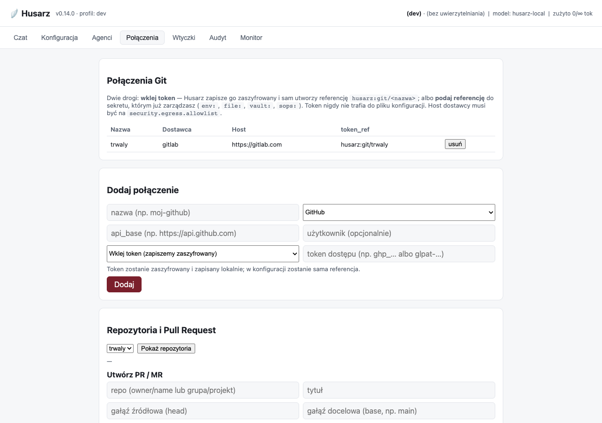

# Integracje Git (GitHub/GitLab) i tworzenie PR (Etap 9)

Husarz łączy się z **własnymi** repozytoriami użytkownika (GitHub/GitLab), listuje je
i tworzy **Pull Request / Merge Request**. Kod: `husarz.git`. To integracja *kodu*,
nie modeli — spójna z zasadą „nie używamy cudzych API modeli".

## Zasady bezpieczeństwa

- **Token jako referencja do sekretu** — połączenie przechowuje `token_ref`
  (`env:GITHUB_TOKEN`, `file:gh`, `vault:…`, `husarz:git/…`), NIGDY samej wartości. Token
  rozwiązywany jest dopiero przy operacji, przez dostawcę sekretów. Dotyczy to także
  tokenu wklejonego w kreatorze: trafia on do szyfrowanego magazynu, a w pliku połączeń
  ląduje wyłącznie wygenerowana referencja (patrz „Dodanie połączenia" niżej).
- **Bramka egress (deny-all)** — host dostawcy (`api.github.com`, `gitlab.com`) musi
  być na `security.egress.allowlist`, inaczej połączenie jest blokowane (`EgressError`
  → HTTP 403). Suwerenność: bez jawnej zgody nie łączymy się z WAN. Git **świadomie nie
  korzysta** ze skrótu „endpoint lokalny jest zawsze wolny" (bezpiecznego dla lokalnego
  Ollamy, nie dla ścieżki niosącej token z prawem zapisu).
- **Anty-SSRF z pinowaniem IP** ([ADR-0020](adr/0020-pinowanie-ip-anty-ssrf.md)) — nazwa
  `api_base` jest rozwiązywana **dokładnie raz**, każdy zwrócony adres sprawdzany, jeden
  **przypinany**: transport łączy się z literałem IP, a nagłówek `Host` i weryfikacja
  certyfikatu TLS (SNI) idą po oryginalnej nazwie. Zamyka to okno DNS-rebindingu, w którym
  atakujący kontrolujący strefę allowlistowanej domeny przechwyciłby token PAT. Pin jest
  świeży przy KAŻDEJ operacji (klient budowany per wywołanie).
- **Polaryzacja adresów dla Git** — loopback (`127.0.0.1`, `localhost`, `*.localhost`)
  jest **twardo zablokowany**, a **prywatna sieć operatora (RFC 1918/ULA) dozwolona**:
  samodzielnie hostowany GitLab pod `https://git.firma.wewn/api/v4` to legalny scenariusz
  suwerenności. Luz dotyczy WYŁĄCZNIE zakresów prywatnych — link-local (metadane chmury
  `169.254.169.254`), CGNAT `100.64.0.0/10` i tunele osadzające IPv4 (6to4/Teredo/NAT64)
  pozostają zablokowane.
- **Transport HTTP wstrzykiwalny** — testy nie wykonują połączeń sieciowych (bezpiecznik
  w `tests/conftest.py` blokuje `socket.getaddrinfo` dla CAŁEGO zestawu testów).
  `trust_env=False` (zmienne `HTTP(S)_PROXY` nie przekierują przypiętego połączenia),
  `follow_redirects=False`, twardy sufit rozmiaru odpowiedzi (anty-OOM) i deadline
  wall-clock; komunikaty błędów transportu są generyczne (bez URL-a i wnętrzności httpx).
- **RBAC** — `git:read` (lista/repozytoria), `git:write` (dodaj/usuń połączenie),
  `git:pr` (utwórz PR). Rola `operator`/`admin` je ma; `user`/`viewer` nie.

## Włączenie

```yaml
# config/git.yaml
enabled: true
connections_path: ./data/git-connections.json   # null = w pamięci

# config/security.yaml → egress.allowlist musi zawierać hosty dostawców:
# allowlist: ["api.github.com", "gitlab.com"]
```

Sekret z tokenem (PAT) dostarcz przez ENV/Vault/SOPS, np. `HUSARZ...`/`GITHUB_TOKEN`
i wskaż go w `token_ref` połączenia.

## Dodanie połączenia — dwie drogi

Token (PAT) generujesz u dostawcy: GitHub → *Settings → Developer settings → Personal access
tokens*; GitLab → *Preferences → Access tokens*. Zakresy: patrz „Ograniczenia" na końcu — nie
są równoważne między dostawcami. Husarz nie generuje tokenów za Ciebie.

Dalej masz do wyboru dwie drogi. **Obie kończą się tak samo**: w pliku połączeń leży
referencja, nigdy materiał.

### A. Wklej token w konsoli (kreator)

Wymaga włączonego magazynu sekretów. Husarz zapisuje token **zaszyfrowany** i sam tworzy
referencję `husarz:git/<nazwa-połączenia>`.

```yaml
# config/security.yaml
secret_store:
  enabled: true
  key_ref: env:HUSARZ_SECRET_STORE_KEY   # klucz GŁÓWNY — schemat zewnętrzny, nie `husarz:`
  path: ./data/secrets/store.json        # null → <data_dir>/secrets/store.json
```

Klucz główny dostarczasz tak, jak każdy inny sekret:

```bash
export HUSARZ_SECRET_STORE_KEY="$(openssl rand -base64 32)"
```

W konsoli: zakładka **Połączenia** → *Dodaj połączenie* → tryb **„Wklej token"**. Pole tokenu
jest hasłowe, a po udanym zapisie jest czyszczone.

{ .shadow loading=lazy }

Przez API to samo robi `POST /api/git/connections/wizard`:

```bash
curl -X POST http://127.0.0.1:8000/api/git/connections/wizard \
  -H 'Content-Type: application/json' \
  -d '{"name":"moj-github","provider":"github",
       "api_base":"https://api.github.com","token":"ghp_..."}'
# → {"name":"moj-github", ..., "token_ref":"husarz:git/moj-github"}
```

Co się dzieje z tokenem — i czego NIE robi Husarz:

| Miejsce | Co tam trafia |
|---|---|
| `data/secrets/store.json` | szyfrogram AES-256-GCM (plik `0600` w katalogu `0700`) |
| `data/git-connections.json` | wyłącznie `husarz:git/<nazwa>` |
| dziennik audytu | nazwa, dostawca i referencja — **nigdy token** |
| odpowiedź HTTP | referencja; pola z tokenem nie ma w modelu odpowiedzi |
| plik konfiguracji | nic |

Usunięcie połączenia kasuje też jego sekret — ale **tylko wtedy**, gdy połączenie faktycznie
używało referencji `husarz:git/<ta-sama-nazwa>`. Sekret wskazany przez `env:` czy `vault:` nie
jest własnością Husarza i nie jest ruszany.

### B. Podaj referencję do sekretu, którym już zarządzasz

Nie wymaga magazynu i pozostaje **zalecana tam, gdzie masz Vaulta albo SOPS-a**: klucz
i materiał zostają w systemie, który już audytujesz.

```bash
export GITHUB_TOKEN="ghp_..."
curl -X POST http://127.0.0.1:8000/api/git/connections \
  -H 'Content-Type: application/json' \
  -d '{"name":"moj-github","provider":"github",
       "api_base":"https://api.github.com","token_ref":"env:GITHUB_TOKEN"}'
```

W konsoli: ten sam formularz, tryb **„Podaj referencję do sekretu"**. Gdy magazyn jest
wyłączony, konsola sama przełącza się w ten tryb i wyjaśnia, czego brakuje — kreator nie
udaje, że działa.

### Którą wybrać

| Sytuacja | Droga |
|---|---|
| Pojedyncza instalacja na własnej maszynie | **A** — jeden krok, bez dotykania powłoki |
| Masz Vaulta / SOPS-a i procedurę rotacji | **B** — nie dubluj zarządzania sekretami |
| Wdrożenie w kontenerze, sekrety wstrzykiwane przez orkiestrator | **B** |
| Chcesz, żeby token przeżył restart bez wpisywania do `.env` | **A** |

!!! warning "Magazyn jest tak mocny, jak ochrona klucza głównego"
    Klucz w Vaulcie daje realną separację. Klucz w zmiennej środowiskowej **obok** pliku
    magazynu chroni przede wszystkim kopie zapasowe i wyniesiony dysk — nie kogoś, kto
    już działa na koncie operatora. Pełny model zagrożeń:
    [BEZPIECZENSTWO.md](BEZPIECZENSTWO.md) i [ADR-0023](adr/0023-zapisywalny-magazyn-sekretow.md).

## Endpointy

| Metoda i ścieżka | Opis | Uprawnienie |
|------------------|------|-------------|
| `GET /api/git/connections` | lista połączeń (bez sekretu; tylko `token_ref`) | `git:read` |
| `POST /api/git/connections` | `{name, provider, api_base, token_ref, username?}` | `git:write` |
| `POST /api/git/connections/wizard` | `{name, provider, api_base, token, username?}` — token zapisywany zaszyfrowany | `git:write` |
| `GET /api/secrets/store` | stan magazynu: `enabled` + nazwy wpisów (bez wartości) | `git:read` |
| `DELETE /api/git/connections/{name}` | usuń połączenie | `git:write` |
| `GET /api/git/connections/{name}/repos` | lista repozytoriów | `git:read` |
| `POST /api/git/connections/{name}/pull-request` | `{repo, title, head, base, body?}` → PR/MR | `git:pr` |

Błędy: nieznane połączenie → `404`; egress zablokowany → `403`; token/dostawca
odrzucił → `502`; kolizja nazwy połączenia → `409`; kreator przy wyłączonym magazynie
→ `409` z instrukcją, co włączyć.

## Konsola

Zakładka **Połączenia**: lista/dodawanie/usuwanie połączeń, podgląd repozytoriów
i formularz utworzenia PR/MR dla wybranego połączenia. Formularz dodawania ma
przełącznik trybu — wklejenie tokenu albo podanie referencji (patrz wyżej).

## Ograniczenia

!!! danger "W profilu `airgap` integracja Git nie działa WCALE"
    Także z GitLabem w Twojej sieci lokalnej. Klient sprawdza allowlistę egress dla
    **każdego** hosta — świadomie nie stosuje skrótu „adres lokalny = zawsze dozwolony" —
    a walidacja profilu `airgap` wymusza **pustą** allowlistę (`husarz.config.schema`,
    walidacja krzyżowa). Żaden host nie przejdzie, więc integracja jest w tym profilu
    wyłączona całkowicie, nie tylko wobec internetu.

    To jest zamierzone (airgap = brak wyjścia), ale bywa zaskoczeniem: operator z własnym
    GitLabem w LAN-ie spodziewa się, że „lokalne" zadziała. Nie zadziała.

!!! warning "Własne CA nie zadziała — blokuje samodzielnie hostowanego GitLaba"
    `HttpxGitTransport` ustawia `verify=True` i `trust_env=False` **na sztywno**
    (`husarz/git/client.py`). `trust_env=False` jest celowe — zmienne `HTTP(S)_PROXY`
    nie mogą przekierować przypiętego połączenia wraz z tokenem przez cudzy serwer — ale
    powoduje też, że `SSL_CERT_FILE` i `REQUESTS_CA_BUNDLE` są **ignorowane**, a pola
    konfiguracyjnego na własny bundle CA **nie ma**.

    Instancja GitLaba z certyfikatem podpisanym przez prywatne CA jest więc nieosiągalna.
    Wymóg `https` w `api_base` operator sobie spełni; prywatnego CA nie wstrzyknie.

    **Uwaga na fałszywy trop:** `security.mtls.ca_cert_ref` wygląda na rozwiązanie, ale
    dotyczy mTLS **między usługami** i — jak cała sekcja `security.mtls` — nie jest dziś
    przez żaden kod odczytywane (mTLS to Etap 6). Ustawienie go nie zmieni niczego.

!!! note "Zakresy nie są równoważne między dostawcami"
    Utworzenie merge requesta na GitLabie wymaga zakresu `api`, czyli **pełnego odczytu
    i zapisu całego API użytkownika** — wszystkich grup, projektów, rejestru kontenerów
    i pakietów. GitHub ma węższy odpowiednik (`pull_requests:write`); GitLabowy
    `write_repository` dotyczy wyłącznie Git-over-HTTP i do MR-ów nie wystarcza.
    Do samego listowania projektów wystarcza `read_api` — nadawaj `api` dopiero wtedy,
    gdy faktycznie tworzysz MR-y.

- Kreator **nie generuje tokenu za Ciebie** — token nadal tworzysz u dostawcy i wklejasz.
  Magazyn sekretów jest warunkiem koniecznym pełnego OAuth (token musi mieć gdzie wylądować),
  ale sam z siebie go nie wprowadza.
- Magazyn nie przypomina o **wygasaniu** tokenu ani go nie rotuje. Ponowny zapis pod tą
  samą nazwą zastępuje wartość — to cała dostępna dziś „rotacja".
- Uwierzytelnianie: **PAT** (token) przez referencję do sekretu. Pełny **OAuth**
  (rejestracja aplikacji + callback) — kolejny krok (lepszy dla trybu hostowanego,
  wielu użytkowników z własnymi tokenami szyfrowanymi at-rest). Uwaga: na GitHubie
  przepływ „kod autoryzacyjny + PKCE" **nie zwalnia z `client_secret`** (dokumentacja
  GitHuba oznacza go jako wymagany także z PKCE), więc jedyną drogą bez sekretu jest
  **device flow** — z widocznym kodem do przepisania, a nie „jednym kliknięciem".
- PR opiera się na istniejących gałęziach po stronie dostawcy; automatyczny commit
  plików + push przez API dostawcy (agent „Kopijnik") — do rozbudowy.

Decyzje: [ADR-0011](adr/0011-integracje-git.md),
[ADR-0023](adr/0023-zapisywalny-magazyn-sekretow.md).
