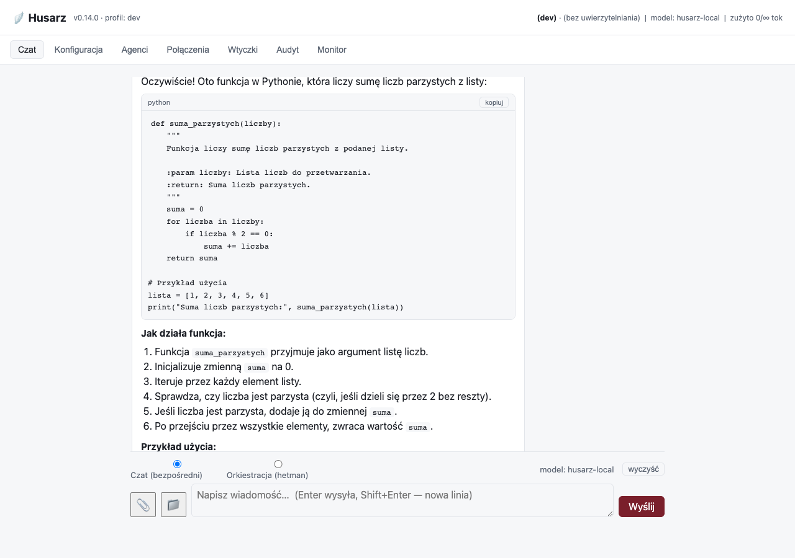
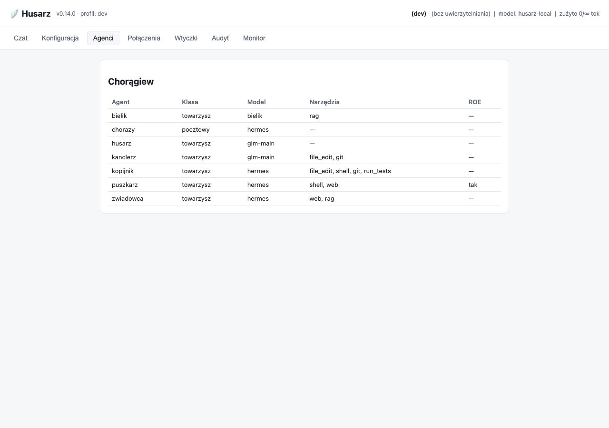
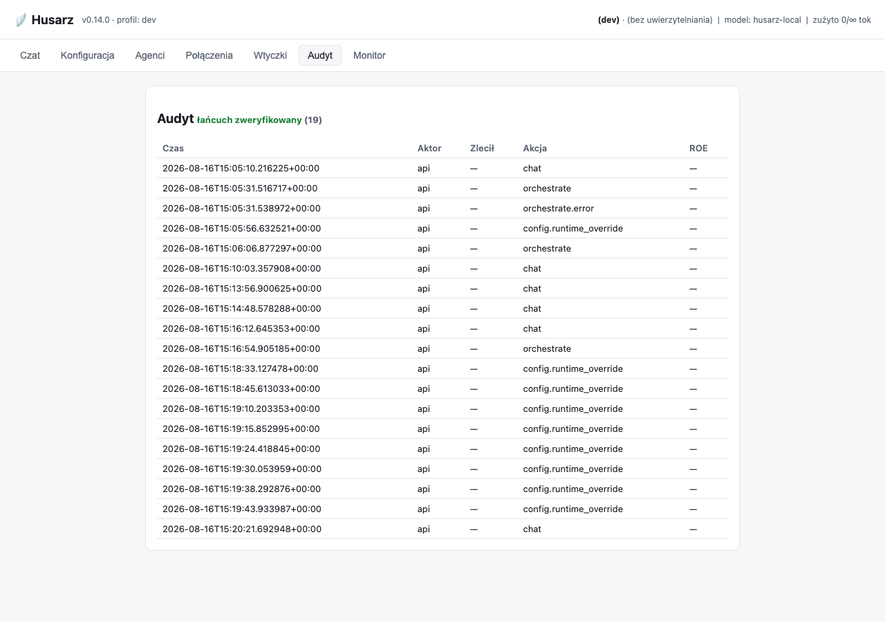
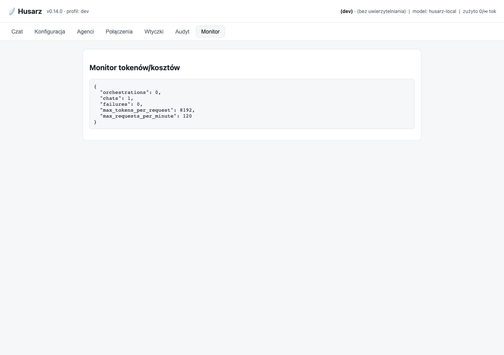

# Husarz — dokumentacja

!!! abstract "Czym jest Husarz"
    **Husarz** to suwerenna, samodzielnie hostowana, wieloagentowa platforma AI (Chorągiew).
    Zasada nadrzędna to **suwerenność danych** — modele i dane **nie opuszczają** infrastruktury
    użytkownika bez wyraźnej zgody. Domyślnie obowiązuje **deny-all egress**.

Ten portal jest generowany z katalogu [`docs/`](https://github.com/Gh0s777tt/Husarz/tree/main/docs)
(MkDocs Material) i stanowi jedno źródło prawdy dla dokumentacji: architektury, bezpieczeństwa,
operacji oraz decyzji projektowych (ADR). Pełną treść można też pobrać jako
[interaktywny PDF](print_page/) („Wersja do druku / PDF").

## Konsola WWW

Husarz udostępnia lokalną **konsolę WWW** (serwowaną przez API pod adresem `/`) do czatu z Chorągwią,
podglądu agentów i narzędzi oraz obsługi runtime.

{ .shadow loading=lazy }

/// caption
Zakładka **Czat** — rozmowa z lokalnym modelem `husarz-local` (Ollama). Odpowiedź renderowana
jako Markdown, bloki kodu z podświetlaniem składni i przyciskiem „kopiuj". Zrzut z profilu `dev`.
///

{ .shadow loading=lazy }

/// caption
Zakładka **Agenci** — skład Chorągwi: klasa agenta, **model efektywny** (z `routing.agent_models`,
a gdy tam `auto` — z pliku agenta), przyznane narzędzia i wymóg ROE (tu: tylko `puszkarz`).
///

{ .shadow loading=lazy }

/// caption
Zakładka **Audyt** — niemodyfikowalny dziennik z weryfikacją łańcucha skrótów (nagłówek
„łańcuch zweryfikowany"). Kolumna *Zlecił* wiąże wywołanie z kontem, które je zleciło;
`—` oznacza wywołanie bez uwierzytelniania (profil `dev` na loopbacku).
///

{ .shadow loading=lazy }

/// caption
Zakładka **Monitor** — liczniki wywołań i obowiązujące limity (`max_tokens_per_request`,
`max_requests_per_minute`).
///

!!! note "Aktualność zrzutów"
    Zrzuty pochodzą z realnie uruchomionej aplikacji i są odświeżane skryptem
    `scripts/screenshots.py` (patrz [CONTRIBUTING.md](https://github.com/Gh0s777tt/Husarz/blob/main/CONTRIBUTING.md)).

## Zasady nadrzędne

<div class="grid cards" markdown>

-   :material-shield-lock: __Suwerenność danych__

    Dane i modele zostają u użytkownika. Domyślnie **deny-all egress**; każde wyjście na sieć
    jest jawnie dozwolone i audytowane.

-   :material-cog-outline: __Zero hardcode__

    Żadnych kluczy, adresów, nazw modeli ani polityk w kodzie. Hierarchia:
    `defaults → config/*.yaml → ENV → sekrety → runtime`, walidowana schematem Pydantic.

-   :material-key-outline: __Sekrety jako referencje__

    Sekrety wyłącznie jako referencje (`env:`/`file:`/`vault:`/`sops:`) — nigdy w repo,
    obrazach ani logach.

-   :material-lock-check: __Bezpieczeństwo domyślne__

    Sandbox bez sieci, niemodyfikowalny audit log, szyfrowanie at-rest, zero telemetrii —
    pokryte testami bezpieczeństwa.

</div>

## Szybki start (dev)

```bash
# 1) Środowisko
python -m venv .venv
.venv/Scripts/python.exe -m pip install -e ".[dev]"

# 2) Walidacja przykładowej konfiguracji (działa out-of-the-box)
.venv/Scripts/python.exe -m husarz.launcher.cli validate --config ./config

# 3) Uruchomienie konsoli (loopback)
.venv/Scripts/python.exe -m husarz.launcher.cli up
```

Szczegóły instalacji i uruchomienia: **[Launcher](LAUNCHER.md)** i **[Wdrożenie](DEPLOY.md)**.

## Mapa dokumentacji

| Obszar | Dokument |
|---|---|
| Całościowy obraz systemu | [Architektura](ARCHITEKTURA.md) |
| Rdzeń agentów i przepływ zadań | [Orkiestrator](ORKIESTRATOR.md) · [Router modeli](ROUTER.md) · [Agenci](AGENCI.md) |
| Narzędzia, sandbox, wtyczki | [Narzędzia i sandbox](NARZEDZIA.md) · [Wtyczki (MCP)](WTYCZKI.md) |
| Model zagrożeń i niezmienniki | [Bezpieczeństwo](BEZPIECZENSTWO.md) |
| Uruchamianie i wdrożenie | [Launcher](LAUNCHER.md) · [Wdrożenie](DEPLOY.md) · [API i konsola](API.md) |
| Konta, sesje, integracje | [Konta i sesje](KONTA.md) · [Integracje Git](GIT.md) |
| Decyzje projektowe | [ADR 0001–0021](adr/0001-uklad-repo.md) |

## Wersja

Bieżące wydanie: **v0.14.0** (patrz [CHANGELOG](https://github.com/Gh0s777tt/Husarz/blob/main/CHANGELOG.md)).
Zakres: pamięć długoterminowa (RAG) z trwałością SQLite i szyfrowaniem at-rest, pętla narzędziowa
(ReAct), konektor MCP (odkrywanie), rejestr providerów narzędzi, obrazy w czacie.
